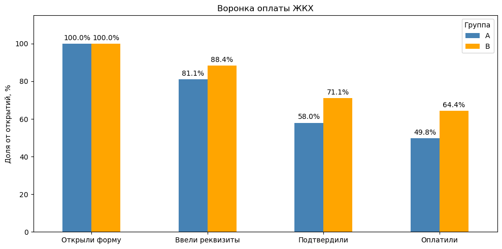
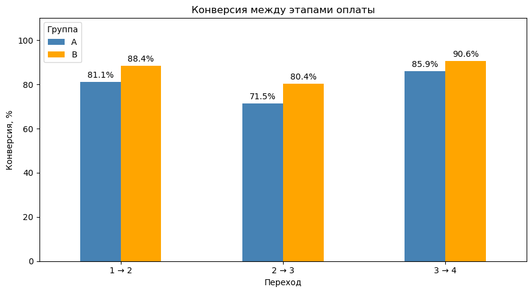

# A/B-тест: новая форма оплаты ЖКХ

## TLDR

- Конверсия попыток оплаты — **49,81% в A против 64,40% в B**.
- Разница — **+14,59 п.п.**, относительный прирост — **+29,3%**.
- 95%-й доверительный интервал разницы по бутстрепу: **[10,94; 18,24] п.п.** Ноль в интервал не входит: данные поддерживают гипотезу роста конверсии.
- Дополнительно проверил пользовательскую конверсию: **65,78% против 80,40%**, Z = 6,386, p ≈ 1,70 × 10⁻¹⁰. Это отдельная метрика: доля людей, оплативших хотя бы раз.

Учебный пет-проект по анализу A/B-теста формы оплаты ЖКХ. Сравниваю обычную форму с вариантом, в котором реквизиты заполняются автоматически. В проекте прошёл весь путь от проверки и очистки данных до визуализации воронки и статистической оценки различий.

Главная особенность данных — один пользователь может совершить несколько попыток оплаты. Поэтому отдельно разбираю конверсию попыток и конверсию пользователей и использую для них разные методы анализа.

## Данные

Период теста — **1–30 апреля 2024 года**. Разделение на A/B проводилось по пользователям. В анализе A — контрольная группа, B — новая форма.

В исходном Excel два листа:

| Лист | Строк | Содержание |
|---|---:|---|
| Пользователи | 1504 | `user_id`, группа, возраст, город, устройство |
| Платежи | 2661 | `payment_id`, `user_id`, группа и даты прохождения четырёх этапов |

Воронка: **открытие формы → ввод реквизитов → подтверждение → успешная оплата**.

Одна строка платежей — одна попытка. Один пользователь может встречаться несколько раз. Если дата следующего этапа отсутствует, попытка до него не дошла.

## Подготовка данных

- Проверил типы, пропуски, повторения идентификаторов, связь таблиц и порядок этапов. Повторений идентификаторов и нарушений хронологии не обнаружено.
- Исключил платёж `99003` без `user_id`: установить пользователя невозможно.
- Исключил пользователя `9001` без группы; его платежей в данных не оказалось.
- Заменил возраст −5 и 150 на пропуски, сохранив пользователей. Пропуск города тоже оставил.
- У платежа `99002` исправил группу B на A по таблице пользователей. **Это допущение:** таблица пользователей принята за источник назначения групп, хотя сам файл не позволяет доказать, какая метка ошибочна.

После очистки осталось **1503 пользователя и 2660 попыток**. Попытки принадлежат **1501 уникальному пользователю: 751 в A и 750 в B**. У двух оставшихся пользователей попыток нет; в расчёты среди открывших форму они не входят.

## Основная метрика и гипотеза

Новая форма с автозаполнением должна увеличить долю успешных попыток:

$$
CR = \frac{\text{Успешные попытки оплаты}}{\text{Открытия формы}},\qquad
\Delta = CR_B - CR_A.
$$

Продуктовая гипотеза ожидает положительную разницу. Для её оценки использую двусторонний 95%-й доверительный интервал.

| Группа | Попытки | Успехи | Конверсия |
|---|---:|---:|---:|
| A | 1309 | 652 | 49,81% |
| B | 1351 | 870 | 64,40% |

На каждом этапе показана доля попыток относительно открытий формы в своей группе.

## Почему бутстреп по пользователям

Обычный Z-тест двух долей по строкам платежей не подходит: попытки одного человека могут быть зависимыми. Поэтому случайно выбираю **пользователей вместе со всеми их попытками**, отдельно внутри A и B.

В каждом из 10 000 повторений считаю отношение суммы успехов к сумме попыток и разницу B − A. Использую `scipy.stats.bootstrap`, процентильный интервал и фиксированный `random_state=42`.

Получено **+14,59 п.п.**, 95% ДИ **[10,94; 18,24] п.п.** Интервал полностью выше нуля. Метод предполагает независимость разных пользователей; это не среднее индивидуальных конверсий и не пересэмплирование отдельных платежей.

## Дополнительный Z-тест

Здесь каждому открывшему форму пользователю присваиваю один результат: 1, если он оплатил хотя бы раз, иначе 0.

| Группа | Открыли форму | Оплатили хотя бы раз | Конверсия |
|---|---:|---:|---:|
| A | 751 | 494 | 65,78% |
| B | 750 | 603 | 80,40% |

Проверяю H₀: p_A = p_B против H₁: p_A ≠ p_B при α = 0,05. `statsmodels.stats.proportion.proportions_ztest` даёт **Z = 6,386, p ≈ 1,70 × 10⁻¹⁰**. Равенство пользовательских конверсий отвергается.

Этот тест дополняет основной анализ, но не заменяет его: один человек с несколькими неудачами и одной успешной оплатой считается сконвертировавшимся пользователем.

## Визуализация

В ноутбуке построены воронка A/B, конверсии переходов и итоговая конверсия попыток. Рядом выведены точные значения и разницы.

Наблюдаемая конверсия B выше на всех переходах. Самая большая разница — между вводом реквизитов и подтверждением: **71,47% → 80,40% (+8,93 п.п.)**. Это описательный результат: отдельные тесты для каждого перехода не проводились, а состав дошедших до этапа мог различаться.

## Итог

В группе B выше и доля успешных попыток, и доля пользователей, оплативших хотя бы раз. Для основной метрики бутстреп-интервал разницы не включает ноль; для дополнительной Z-тест отвергает равенство долей.

Эти результаты отвечают на разные вопросы. Конверсия попыток показывает, как часто открытие формы заканчивается оплатой. Пользовательская конверсия — сколько людей смогли оплатить хотя бы один раз за период. Их важно не смешивать, даже когда направление эффекта совпадает.

## Ограничения анализа

- Принадлежность платежа `99002` к группе A восстановлена по таблице пользователей: это принятое допущение.
- Метрики рассчитываются среди открывших форму. Такая интерпретация предполагает, что вариант формы не влияет на сам факт открытия.
- Бутстреп учитывает повторные попытки внутри пользователя, но не устраняет возможные различия состава групп. Предполагается независимость разных пользователей.

## Запуск

Порядок установки библиотек и настройки пути к Excel — в [Howtorun.md](Howtorun.md). Зависимости перечислены в [requirements.txt](requirements.txt).

Стек: Python, pandas, NumPy, Matplotlib, SciPy, statsmodels, Jupyter.
